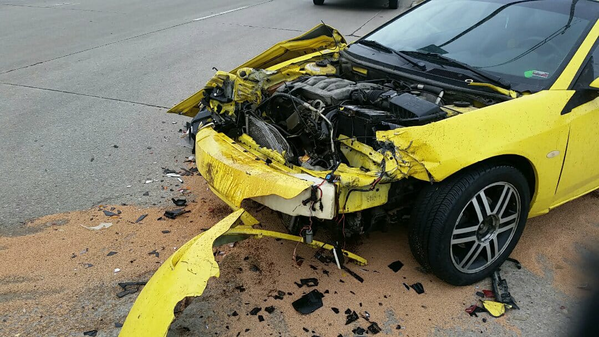

## My Vehicle ##

#### Below is a list of all the vehicles I have driven ####

All together I have owned and driven quite a few vehicles. Here is a table to display all the different types of vehicles I have driven:

Type | Quantity
--- | ---
Cars | 4
Trucks | 2
Others | 3 

---

My vehicles I've owned are:

* *Ford Windstar*
* *Mercury Cougar*
* *Ford Focus*
* *Tao Tao Dirtbike*


***

Here is a picture of my second vehicle, taken **after** it was sold to my friend.


***


>My favorite vehicle that I have driven is my dad's homemade dune buggy.
>It's also the only vehicle that I have driven with a manual transmission not an  ~~automatic~~.


```C
#include <stdio.h>
int main()
{
   printf("I also really like my dirtbike!");
   return 0;
}
```

***

### I also have quite a few cars that I would like to own. ###

These are the cars that I would like to own, with my favorite being first:

1. Nissan Skyline
2. Toyota Supra
3. Honda NSX
4. Mazda Miata
5. Dodge Challenger
6. Toyota Tacoma


This is my dream car.


Here is some information about my favorite car, the [Nissan Skyline.](<http://gtrnissanskyline.com/r34-gtr/>)


***


***

To return to the home page click [here.](https://github.com/StevenVaughan97/My-Vehicles/blob/master/README.md)